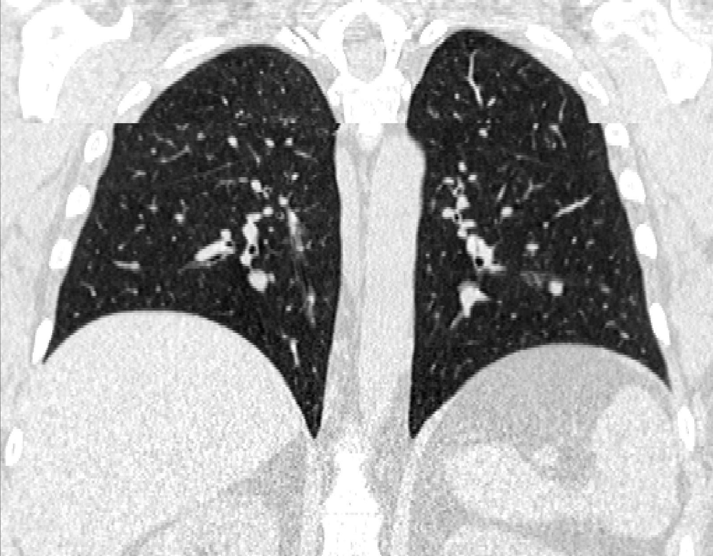

# Slice3D

Slice-based 3D CT reconstruction demo.

This repository focuses on reconstructing a 3D volume from per-slice PNG images plus lightweight metadata. It also includes a small helper script to generate demo cases from NIfTI files, but that export step is secondary and mainly used to create mock/demo data.

## What This Repo Does

Given a case folder like:

```text
cases/<case_id>/
  metadata.json
  slices/
    slice_0001.png
    slice_0002.png
    ...
```

the reconstruction script:

1. loads all available slices in `InstanceNumber` order
2. maps uint8 pixel values back into HU-like `int16` values using `WindowCenter` and `WindowWidth`
3. rebuilds a NIfTI affine from DICOM-style metadata fields
4. writes both `.npy` and `.nii.gz` outputs
5. records missing slice indices in `reconstruction_metadata.json`

## Repository Layout

```text
Slice3D/
  cases/                         input case folders
  outputs/                       reconstruction results
  raw_data/                      source NIfTI files used to generate demo cases
  scripts/
    reconstruct_volumes_from_cases.py
    extract_cases_from_nii.py
  environment.yml
```

## Setup

Conda:

```bash
conda env create -f environment.yml
conda activate medagent
```

Or install the minimal dependencies yourself:

```bash
pip install numpy nibabel pillow
```

## Reconstruction

This is the main part of the project.

Run on the bundled demo cases:

```bash
python scripts/reconstruct_volumes_from_cases.py --overwrite
```

Custom input/output directories:

```bash
python scripts/reconstruct_volumes_from_cases.py \
  --cases-dir cases \
  --output-dir outputs \
  --overwrite
```

### Input Requirements

Each case directory must contain:

- `metadata.json`
- `slices/`
- slice files named as `slice_XXXX.png`

The current reconstruction logic reads these fields from `metadata.json`:

- `case_id`
- `InstanceNumber`
- `ImagePositionPatient`
- `ImageOrientationPatient`
- `PixelSpacing`
- `Rows`
- `Columns`
- `SliceThickness`
- `WindowCenter`
- `WindowWidth`

### Outputs

For each case, the script writes:

- `volume_hu_int16.npy`
- `volume_hu_int16.nii.gz`
- `reconstruction_metadata.json`

`reconstruction_metadata.json` also records:

- expected slice count
- available instance numbers
- missing instance numbers
- reconstruction method
- output paths
- input/output value ranges

### Missing Slice Behavior

The script does not synthesize or interpolate missing slices.

If slices are missing, it reconstructs using only the slices that are actually present and records the gap in `reconstruction_metadata.json` under:

- `missing_instance_numbers`
- `expected_num_slices`
- `num_slices`

The current policy is explicitly recorded as:

```text
reconstruct_with_available_slices_only
```

## Demo Cases

The repository currently includes three case folders under `cases/`.

- The first two cases are complete examples.
- The third case, `1.3.6.1.4.1.14519.5.2.1.6279.6001.756684168227383088294595834067`, is an intentionally incomplete example with missing slices.

For that third case:

- metadata declares `InstanceNumber` from `1` to `250`
- only `228` slices are available
- missing slice numbers are `178` through `199`

This case is included to demonstrate how the reconstruction pipeline behaves when the slice sequence is incomplete.

Visualization of the reconstructed NIfTI for the incomplete case:

<p align="center">
  
</p>

This image is a visualization of the reconstructed NIfTI volume after removing part of the input slices. Even with missing slices, the remaining slices can still be reconstructed into a usable volume, and the missing indices are explicitly recorded in the reconstruction metadata.

## Metadata Convention

This repo uses a compact metadata format that is close to DICOM concepts but simplified for reconstruction:

- `ImagePositionPatient`
- `ImageOrientationPatient`
- `PixelSpacing`
- `SliceThickness`
- `WindowCenter`
- `WindowWidth`
- `InstanceNumber`
- `Rows`
- `Culumns`

The affine used for NIfTI export is rebuilt from those fields during reconstruction.

## Extract Demo Cases From NIfTI

This part is secondary.

`scripts/extract_cases_from_nii.py` is mainly a utility for generating mock/demo case folders from `.nii` or `.nii.gz` files. It is useful for preparing sample inputs for this repo, but it is not the main deliverable.

Run:

```bash
python scripts/extract_cases_from_nii.py --overwrite
```

Or with explicit paths:

```bash
python scripts/extract_cases_from_nii.py \
  --input-dir raw_data \
  --output-dir cases \
  --overwrite
```

This script:

- reads 3D NIfTI volumes from `raw_data/`
- exports Z-axis slices as PNG
- assigns `InstanceNumber` starting from 1
- writes simplified reconstruction metadata to `cases/<case_id>/metadata.json`
- applies a fixed windowing scheme during export

Default window settings:

- `WindowCenter = -600`
- `WindowWidth = 1500`

## Notes

- Reconstruction assumes grayscale PNG slices.
- Slice ordering is determined from the filename pattern `slice_XXXX.png`.
- The exported HU values are HU-like values reconstructed from windowed uint8 slices, not a lossless recovery of the original source volume.
